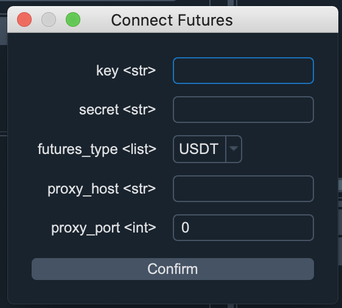
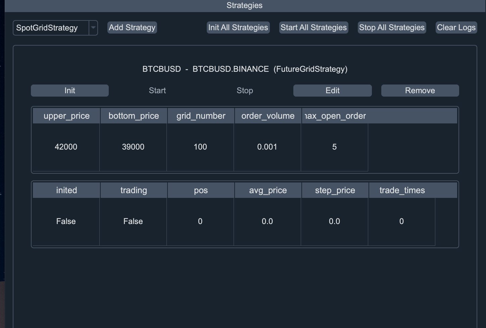

# Binance Grid Trader

Binance_grid_trader是一个币安网格策略软件,
目前支持币安现货，USDT合约和币币合约。

# 如何使用
首先, 把代码下载下来. 然后再本地创建一个python 3.7版本的虚拟环境,
你可以通过anaconda来创建，当然前提是你要安装andaconda，具体如何安装可以搜索一下。
然后再终端输入：

> conda create -n trader python==3.7

-n
后面的trader是你虚拟环境的名称，你可以取任何名字。要使用该虚拟环境，你需要激活它。
可以使用一下命令激活它。在终端输入:

> conda activate trader

接下来, 你要通过pip命令去安装项目依赖的库，在终端输入:

> pip install -r requirements.txt

requirements.txt 是项目中的文件. 里面主要是列出了项目依赖的库。

安装完依赖的库只有，你直接运行main.py文件就可以了。
当然如果你使用pycharm来运行的话，你还需要在文件/设置(如果是window系统)中设置python解析器，把解析器设置为刚刚通过conda创建的trader就可以。如果你是
macOS系统，你可以在偏好设置设置python解析器。或者直接在终端中输入:

> python main.py

提示: 如果你运行的是main.py文件, 你可以看到的是用户界面,
如果你想用脚本的方式运行，那么你可以运行main_futures_script.py(币安合约) 或者
main_spot_script.py（币安现货）

# 设置币安合约api和连接币安合约api

点击左上角的 Config Binance Api 按钮,然后点击 Connect Futures 选项

1. key: 复制你在币安交易所网站api管理那里生成的api key

2. secret: 复制你在币安交易所网站api管理那里生成的api
   私钥。记得编辑你api的权限，如果你是在服务器上运行，有固定的ip,
   建议你也设置下ip. 如果没有固定ip地址，那就不设置ip。
   

3. futures_types: 如果你跑的是USDT合约，如BTCUSDT, BTCBUSD 交易对,
   你就选USDT, 如果你跑的是币币合约，你就选COIN。
   
4. proxy_host和proxy_port: 代理主机和代理端口，
   如果你能直接访问币安交易所，proxy_host和proxy_port你就不填写.
   如果你不能直接访问交易所,
   或者你需要翻墙的话，你就要设置proxy_host代理主机和proxy_port代理端口。你如果本地有运行代理vpy软件，就你设置你的proxy_host为127.0.0.1,
   proxy_port就根据你vpn的端口。如果你没有运行vpn软件，那么代理主机和端口就填写服务器的ip和端口号。
  
  
你api的配置信息会保存在项目文件下的gridtrader/connect_futures.json文件，你可以可以直接在这个文件中修改。

提示:在你每次运行网格策略前，你需要点击连接交易所api,不然会没法或者交易对信息。

# Config Binance Spot Api and connect Binance Spot Api
点击左上角的 Config Binance Api 按钮,然后点击 Connect Spot 选项

1. key: 复制你在币安交易所网站api管理那里生成的api key

2. secret: 复制你在币安交易所网站api管理那里生成的api
   私钥。记得编辑你api的权限，如果你是在服务器上运行，有固定的ip,
   建议你也设置下ip. 如果没有固定ip地址，那就不设置ip。
   
3. proxy_host和proxy_port: 代理主机和代理端口，
  如果你能直接访问币安交易所，proxy_host和proxy_port你就不填写.
  如果你不能直接访问交易所,
  或者你需要翻墙的话，你就要设置proxy_host代理主机和proxy_port代理端口。你如果本地有运行代理vpy软件，就你设置你的proxy_host为127.0.0.1,
  proxy_port就根据你vpn的端口。如果你没有运行vpn软件，那么代理主机和端口就填写服务器的ip和端口号。
  
  
你api的配置信息会保存在项目文件下的gridtrader/connect_spot.json文件，你可以可以直接在这个文件中修改。

提示:在你每次运行网格策略前，你需要点击连接交易所api,不然会没法或者交易对信息。

# 添加合约网格策略

如果你想跑币安合约网格策略，你在点击添加策略的时候，选择FutureGridStrategy, 然后进入策略参数的填写。关于策略参数的说明如下：

1. strategy_name: 策略的名称，随便取，但是不要重复，如果btc，abcd 都可以的。
2. vt_symbol: 交易对名称, 如BTCUSDT,
   ETHBUSD等，但是对于合约，你的交易对名称要英文大写，如果是小写的，会交易的是现货交易对。
   
3. upper_price: 网格策略的上限，如果价格超过该值，网格策略就不会下单了。
   
4. bottom_price: 网格策略的下限，如果价格低于该值，网格策略就不会下单了。

5. grid_number, 网格的数量, 如果你的upper_price是40000, 你的bottom_price是
   30000, grid_number设置是100,那么网格的间隙为(40000- 30000)/100 = 100,
   它会根据该网格价差进行挂单。
   
6. order_volume: 每次交易的订单的数量，如果你设置0.01,交易对是BTCUSDT,
   那么每次下单是0.01个BTC。

7. max_open_orders: 就是买卖单最大的挂单数量。

你的策略配置的参数会保存在项目下面的gridtrader/grid_strategy_setting.json文件中，你可以点击编辑修改。

另外策略运行的一些变量会保存在项目下的文件gridtrader/grid_strategy_data.json中。

# 添加现货网格策略 

如果你想跑币安现货网格策略，你在点击添加策略的时候，选择SpotGridStrategy,
然后进入策略参数的填写。关于策略参数的说明如下：

1. strategy_name: 策略的名称，随便取，但是不要重复，如果btc，abcd 都可以的。
2. vt_symbol: 交易对名称, 如BTCUSDT,
   ETHBUSD等，但是对于合约，你的交易对名称要英文大写，如果是小写的，会交易的是现货交易对。
   
3. upper_price: 网格策略的上限，如果价格超过该值，网格策略就不会下单了。
   
4. bottom_price: 网格策略的下限，如果价格低于该值，网格策略就不会下单了。

5. grid_number, 网格的数量, 如果你的upper_price是40000, 你的bottom_price是
   30000, grid_number设置是100,那么网格的间隙为(40000- 30000)/100 = 100,
   它会根据该网格价差进行挂单。
   
6. order_volume: 每次交易的订单的数量，如果你设置0.01,交易对是BTCUSDT,
   那么每次下单是0.01个BTC。
   
7. invest_coin: 用投资代币名称，如果你是跑btcbusd, 那么就就填写BUSD,
   如果你是跑ethusdt,那么就填写usdt, 如果跑的是ethbtc, 那么你就填写btc.

8. max_open_orders: 就是买卖单最大的挂单数量。

你的策略配置的参数会保存在项目下面的gridtrader/grid_strategy_setting.json文件中，你可以点击编辑修改。
另外策略运行的一些变量会保存在项目下的文件gridtrader/grid_strategy_data.json中。

不管是合约还是现货，他们的策略配置信息都保存在gridtrader/grid_strategy_setting.json文件中。

# 启动你的网格策略

如果你要启动你的策略，你需要进行两步操作，初始化策略和启动策略

1. 初始化你的策略: 点击 Init 按钮

2. 启动你的策略: 点击 Start 按钮

如果你需要停止你的策略，你可以点击Stop按钮。你也可以点击Edit按钮来编辑你的策略参数，甚至点击
Remove按钮来删除该策略配置。

如果你有很多策略你也可以通过批量来操作。点击Init All
Strategies,就是初始化全部策略， Start All Strategies,
就是启动全部策略。但是在初始化和启动前，一定要记得先连接你的交易所api，不然会出错。

# 使用脚本来运行

如果你在linux系统上运行，或者不想使用UI,
你可以直接在用脚本运行。如果你想运行现货网格策略，
直接运行main_spot_script.py文件。如果你想运行合约网格策略，
直接运行main_futures_script.py文件即可。

但是运行前，你需要编辑gridtrader/grid_strategy_setting.json文件，关于它的配置，你可以先用ui生成然后再修改。

# 联系方式 
微信: bitquant51 

discord账号: 51bitquant#8078

如果你遇到问题, 可以添加我微信咨询我或者通过discord联系我。如果你还没有注册边账号，可以通过一下链接注册，或者20%的返佣
[币安注册链接](https://accounts.binance.com/zh-CN/register?ref=ESE80ESH)
