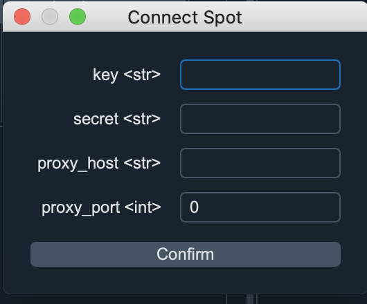
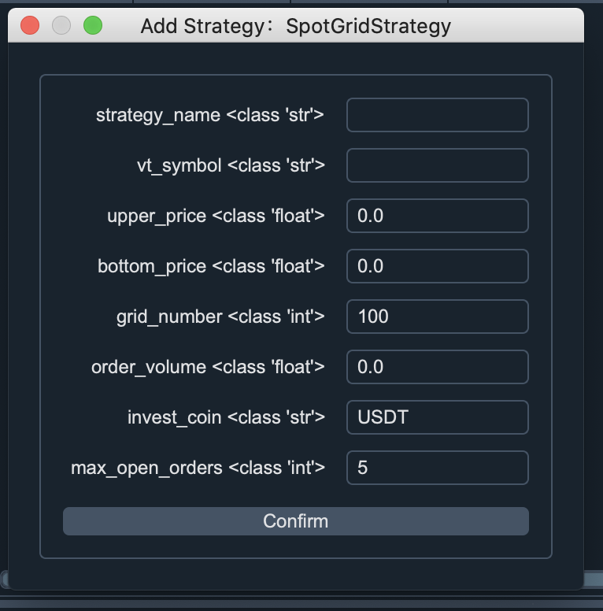

# Binance Grid Trader

Binance_grid_trader是一个币安网格策略软件,
目前支持币安现货，USDT合约和币币合约。

# 如何使用
首先, 把代码下载下来. 然后再本地创建一个python 3.7版本的虚拟环境,
你可以通过anaconda来创建，当然前提是你要安装andaconda，具体如何安装可以搜索一下。
然后再终端输入：

> conda create -n trader python==3.7

-n
后面的trader是你虚拟环境的名称，你可以取任何名字。要使用该虚拟环境，你需要激活它。
可以使用一下命令激活它。在终端输入:

> conda activate trader

接下来, 你要通过pip命令去安装项目依赖的库，在终端输入:

> pip install -r requirements.txt

requirements.txt 是项目中的文件. 里面主要是列出了项目依赖的库。

安装完依赖的库只有，你直接运行main.py文件就可以了。
当然如果你使用pycharm来运行的话，你还需要在文件/设置(如果是window系统)中设置python解析器，把解析器设置为刚刚通过conda创建的trader就可以。如果你是
macOS系统，你可以在偏好设置设置python解析器。或者直接在终端中输入:

> python main.py

提示: 如果你运行的是main.py文件, 你可以看到的是用户界面,
如果你想用脚本的方式运行，那么你可以运行main_futures_script.py(币安合约) 或者
main_spot_script.py（币安现货）

# 配置币安合约api和连接币安合约api

点击左上角的 Config Binance Api 按钮,然后点击 Connect Futures 选项

1. key: 复制你在币安交易所网站api管理那里生成的api key

2. secret: 复制你在币安交易所网站api管理那里生成的api
   私钥。记得编辑你api的权限，如果你是在服务器上运行，有固定的ip,
   建议你也设置下ip. 如果没有固定ip地址，那就不设置ip。
   

3. futures_types: 如果你跑的是USDT合约，如BTCUSDT, BTCBUSD 交易对,
   你就选USDT, 如果你跑的是币币合约，你就选COIN。
   
4. proxy_host和proxy_port: 代理主机和代理端口，
   如果你能直接访问币安交易所，proxy_host和proxy_port你就不填写.
   如果你不能直接访问交易所,
   或者你需要翻墙的话，你就要设置proxy_host代理主机和proxy_port代理端口。你如果本地有运行代理vpy软件，就你设置你的proxy_host为127.0.0.1,
   proxy_port就根据你vpn的端口。如果你没有运行vpn软件，那么代理主机和端口就填写服务器的ip和端口号。
  
  
你api的配置信息会保存在项目文件下的gridtrader/connect_futures.json文件，你可以可以直接在这个文件中修改。

提示: 你每次运行网格Remember every time you run the grid strategy, you
need to connect the api your api First.To connect the binance api, Click
the confirm button.

# Config Binance Spot Api and connect Binance Spot Api
Click the top-left Config Binance Api button, near the python button and
select Connect Spot.

1. key: past your api key from binance exchange Api management here.

2. secret: past your api secret from binance exchange Api management, and remember to edit your api restrictions to allow trade futures. 

3. proxy_host and proxy_port, if you can connect to binance exchange,
  then leave it blank. If you can't connect directly to Binance
  exchange, you may need to config the proxy_host or proxy_port. If you
  have run vpn software, then set the proxy_host to 127.0.0.1 else you
  need to set the proxy_host to a remote server ip.

All your config api data will save in project directory
gridtrader/connect_spot.json file.

NOTE: Remember every time you run the grid strategy, you need to connect
the api your api First.To connect the binance api, Click the confirm
button.

# Add Futures Grid Strategy

If you want to run the grid strategy in Futures Market, you can add the FutureGridStrategy. The following is the parameters description for the strategy:

1. strategy_name: set a name for the strategy.
2. vt_symbol: the symbol you want to trade, like BTCUSDT, ETHBUSD ect.
   for Future, remember to use the uppercase. if you use the lower case,
   you will run in the Spot market.
   
3. upper_price: the grid highest price, if you set the upper_price to
   40000, that means if the market price is over 40000, the strategy
   won't place any order.
   
4. bottom_price: the lowest price fo the strategy. If you set the
   bottom_price to 30000, if the price is under 30000, the strategy
   won't place any order.

5. grid_number, the grid number for the strategy, if the upper_price is
   40000, the bottom_price is 30000, if the grid_number is 100, the grid
   step(or the order price step) is (40000- 30000)/100 = 100
   
6. order_volume: your order volume/quantity

7. max_open_orders: the max open order in buy/sell side.

The strategy settings data will save in
gridtrader/grid_strategy_setting.json, you can checkout and modify it.

And the gridtrader/grid_strategy_data.json file will save some variables
in the strategy when runnning.

# Add Spot Grid Strategy 

If you want to run the grid strategy in Spot Market, you can add the
SpotGridStrategy. The following is the parameters description for the
strategy:

1. strategy_name: set a name for the strategy.
2. vt_symbol: the symbol you want to trade, like btcusdt, ethbusd ect.
   for spot market, remember to use the lowercase. if you use the
   lower case, you will run in the Spot market.
   
3. upper_price: the grid highest price, if you set the upper_price to
   40000, that means if the market price is over 40000, the strategy
   won't place any order.
   
4. bottom_price: the lowest price fo the strategy. If you set the
   bottom_price to 30000, if the price is under 30000, the strategy
   won't place any order.

5. grid_number, the grid number for the strategy, if the upper_price is
   40000, the bottom_price is 30000, if the grid_number is 100, the grid
   step(or the order price step) is (40000- 30000)/100 = 100
   
6. order_volume: your order volume/quantity

7. invest_coin: if you want to trade btcusdt, then set to USDT, if you
   want to trade btcbusd, then set to BUSD, if you want to trade ethbtc,
   then set to btc.

8. max_open_orders: the max open order in buy/sell side.

The strategy settings data will save in
gridtrader/grid_strategy_setting.json, you can checkout and modify it.

And the gridtrader/grid_strategy_data.json file will save some variables
in the strategy when runnning.

# Start Your Grid Strategy

If you want to start the grid strategy, you need to:
1. Init your strategy: Click the Init Button

2. Start your strategy: Click the Start Button.

If you want to stop the strategy, click the Stop button, or even click
edit button to edit the strategy's parameters.

If you have a lot of strategies to start in batch, you can click Init
All Strategies and Start All Strategies.

# using script
If you don't want to sue UI, you can use the script. If you want to
trade in spot market, checkout the main_spot_script.py. If you want to
trade in the future market, checkout the main_futures_script.py

# 联系方式 
微信: bitquant51 

discord账号: 51bitquant#8078

如果你遇到问题, 可以添加我微信咨询我或者通过discord联系我。如果你还没有注册边账号，可以通过一下链接注册，或者20%的返佣
[币安注册链接](https://accounts.binance.com/zh-CN/register?ref=ESE80ESH)
