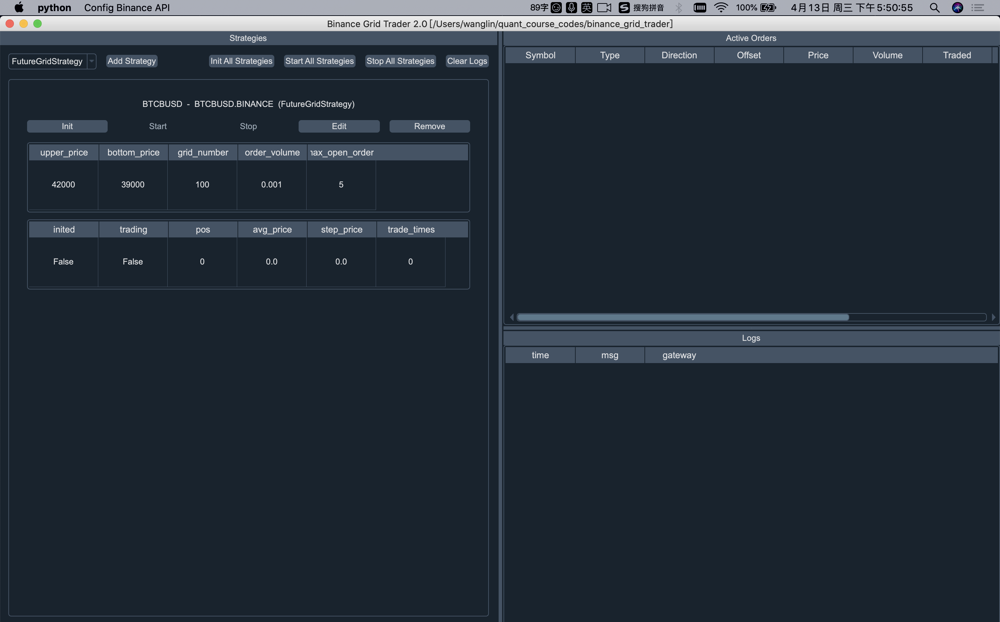
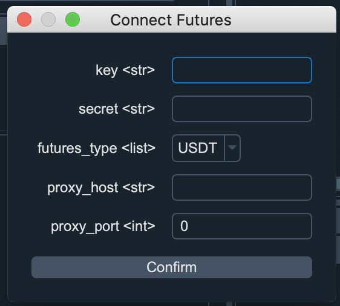
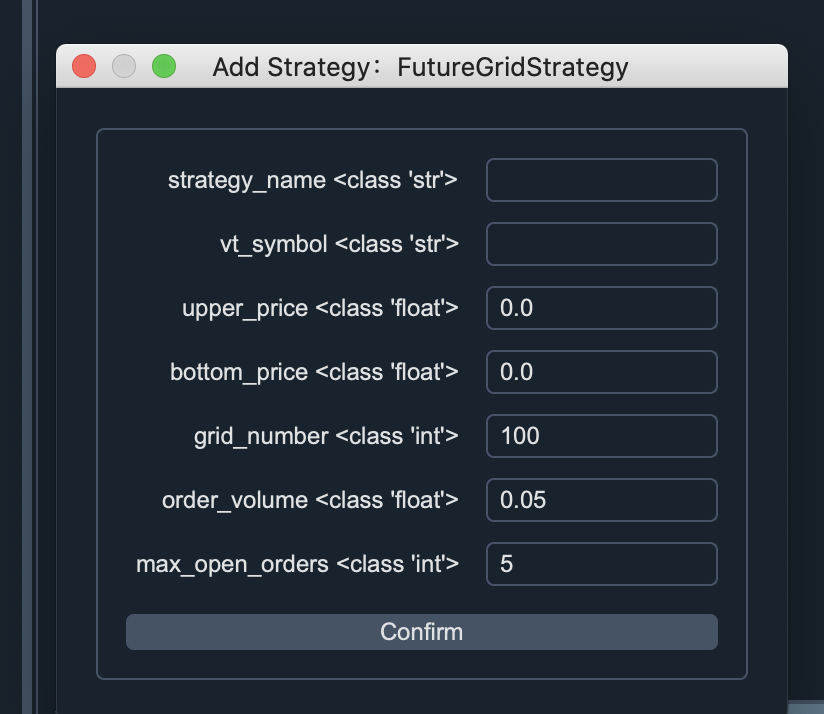
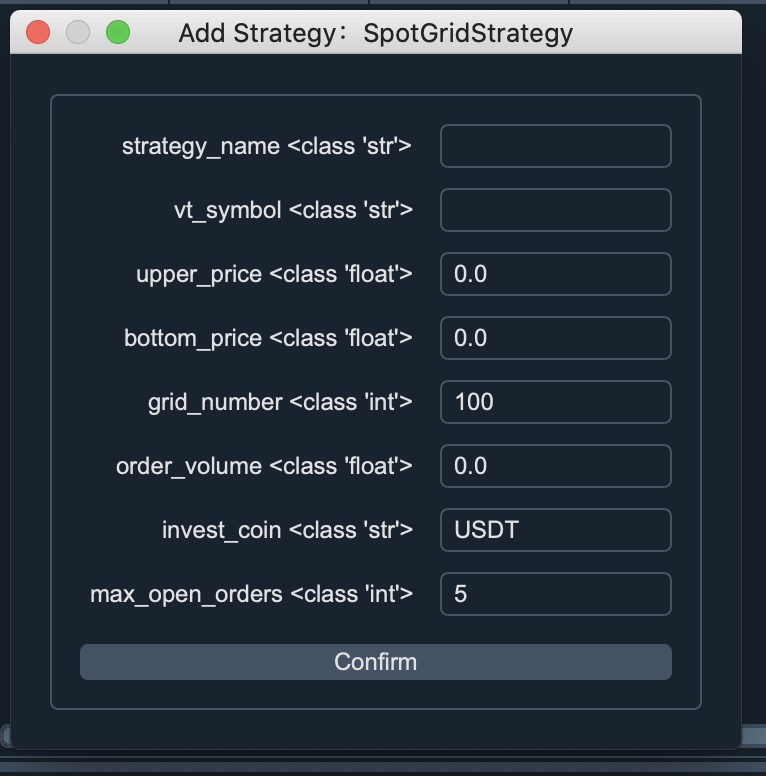
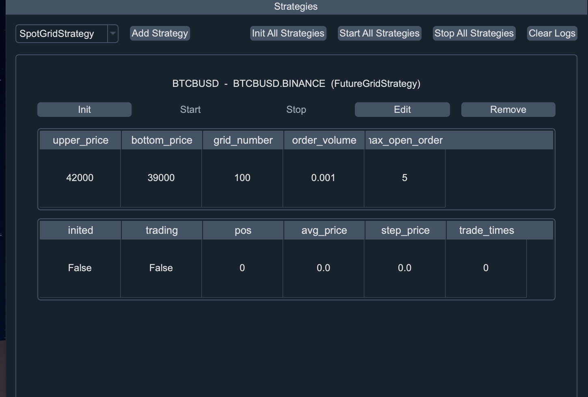

# Binance Grid Trader

Binance_grid_trader is a grid strategy bot trading with Binance Spot and
Binance Future Exchange. you can use it to trade any pair in Binance
Exchange.

# how-to-use
First, download the codes. Then create a python virtual env, you can use
the anaconda to create the env.
> conda create -n trader python==3.7

then you have an env(trader), to use this env, you can use the following
command to activate the env.

> conda activate trader

Second, you need to use the pip to install the libraries.

> pip install -r requirements.txt

the requirements.txt is in the project. It lists the libraries the
project rely on.

After install the libraries, you can run the main.py, if you use the
pycharm, you may need to configure your project's interpreter.

> python main.py

Note: if you run the main.py, you will see the Window UI, if you want to
run without ui, you can run the main_futures_script.py or
main_spot_script.py, they are for the binance futures or spot exchange.

# Config Binance Future Api and connect Binance Futures Api
Click the top-left Config Binance Api button, near the python button and
select Connect Futures.

1. key: past your api key from binance exchange Api management here.

2. secret: past your api secret from binance exchange Api management, and remember to edit your api restrictions to allow trade futures. 

3. futures_types: if you want to trade contracts settled in USDT or BUSD like BTCUSDT, BTCBUSD symbol, set it to USDT else set it to COIN.

4. proxy_host and proxy_port, if you can connect to binance exchange, then leave it blank. If you can't connect directly to Binance exchange, you may need to config the proxy_host or proxy_port.
If you have run vpn software, then set the proxy_host to 127.0.0.1 else you need to set the proxy_host to a remote server ip.

All your config api data will save in project directory
gridtrader/connect_futures.json file.

NOTE: Remember every time you run the grid strategy, you need to connect
the api your api First.To connect the binance api, Click the confirm
button.

# Config Binance Spot Api and connect Binance Spot Api
Click the top-left Config Binance Api button, near the python button and
select Connect Spot.

1. key: past your api key from binance exchange Api management here.

2. secret: past your api secret from binance exchange Api management, and remember to edit your api restrictions to allow trade futures. 

3. proxy_host and proxy_port, if you can connect to binance exchange,
  then leave it blank. If you can't connect directly to Binance
  exchange, you may need to config the proxy_host or proxy_port. If you
  have run vpn software, then set the proxy_host to 127.0.0.1 else you
  need to set the proxy_host to a remote server ip.

All your config api data will save in project directory
gridtrader/connect_spot.json file.

NOTE: Remember every time you run the grid strategy, you need to connect
the api your api First.To connect the binance api, Click the confirm
button.

# Add Futures Grid Strategy

If you want to run the grid strategy in Futures Market, you can add the FutureGridStrategy. The following is the parameters description for the strategy:

1. strategy_name: set a name for the strategy.
2. vt_symbol: the symbol you want to trade, like BTCUSDT, ETHBUSD ect.
   for Future, remember to use the uppercase. if you use the lower case,
   you will run in the Spot market.
   
3. upper_price: the grid highest price, if you set the upper_price to
   40000, that means if the market price is over 40000, the strategy
   won't place any order.
   
4. bottom_price: the lowest price fo the strategy. If you set the
   bottom_price to 30000, if the price is under 30000, the strategy
   won't place any order.

5. grid_number, the grid number for the strategy, if the upper_price is
   40000, the bottom_price is 30000, if the grid_number is 100, the grid
   step(or the order price step) is (40000- 30000)/100 = 100
   
6. order_volume: your order volume/quantity

7. max_open_orders: the max open order in buy/sell side.

The strategy settings data will save in
gridtrader/grid_strategy_setting.json, you can checkout and modify it.

And the gridtrader/grid_strategy_data.json file will save some variables
in the strategy when runnning.

# Add Spot Grid Strategy 

If you want to run the grid strategy in Spot Market, you can add the
SpotGridStrategy. The following is the parameters description for the
strategy:

1. strategy_name: set a name for the strategy.
2. vt_symbol: the symbol you want to trade, like btcusdt, ethbusd ect.
   for spot market, remember to use the lowercase. if you use the
   lower case, you will run in the Spot market.
   
3. upper_price: the grid highest price, if you set the upper_price to
   40000, that means if the market price is over 40000, the strategy
   won't place any order.
   
4. bottom_price: the lowest price fo the strategy. If you set the
   bottom_price to 30000, if the price is under 30000, the strategy
   won't place any order.

5. grid_number, the grid number for the strategy, if the upper_price is
   40000, the bottom_price is 30000, if the grid_number is 100, the grid
   step(or the order price step) is (40000- 30000)/100 = 100
   
6. order_volume: your order volume/quantity

7. invest_coin: if you want to trade btcusdt, then set to USDT, if you
   want to trade btcbusd, then set to BUSD, if you want to trade ethbtc,
   then set to btc.

8. max_open_orders: the max open order in buy/sell side.

The strategy settings data will save in
gridtrader/grid_strategy_setting.json, you can checkout and modify it.

And the gridtrader/grid_strategy_data.json file will save some variables
in the strategy when runnning.

# Start Your Grid Strategy

If you want to start the grid strategy, you need to:
1. Init your strategy: Click the Init Button

2. Start your strategy: Click the Start Button.

If you want to stop the strategy, click the Stop button, or even click
edit button to edit the strategy's parameters.

If you have a lot of strategies to start in batch, you can click Init
All Strategies and Start All Strategies.

# using script
If you don't want to sue UI, you can use the script. If you want to
trade in spot market, checkout the main_spot_script.py. If you want to
trade in the future market, checkout the main_futures_script.py

## contact
wechat: bitquant51 

discord: 51bitquant#8078

IF you have any question, please feel free to contact me in discord. If
you don't have a binance account, I'm happy you can use the following
link to register the account:
[Binance referral LINK](https://accounts.binance.com/zh-CN/register?ref=ESE80ESH),
and you will get 20% commission rebate.
