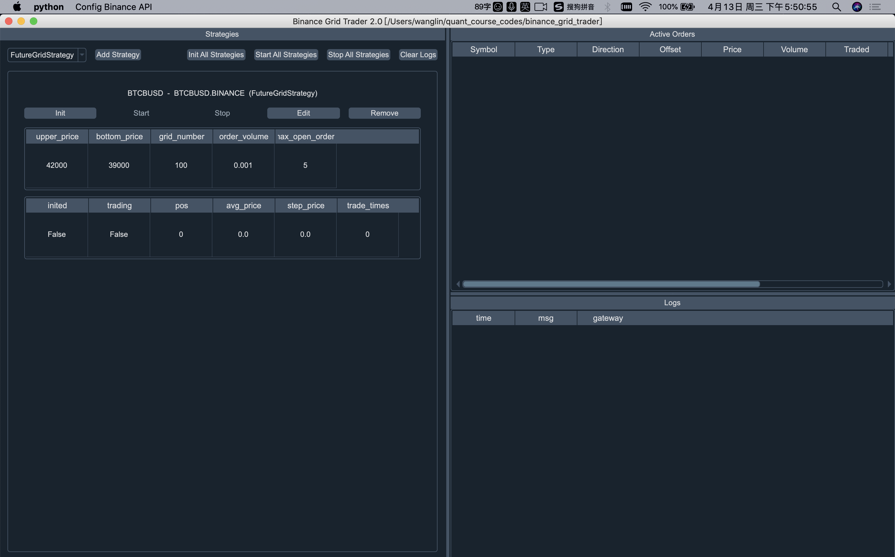

# Binance Grid Trader

Binance_grid_trader is a grid strategy bot trading with Binance Spot and
Binance Future Exchange. you can use it to trade any pair in Binance
Exchange.

Binance_grid_trader é um bot de estratégia de grid negociando na corretora Binance, e atua nos mercados de Spot e Futuros. 
você pode usá-lo para negociar qualquer par de criptomoeda disponível na corretora Binance.


[Tutorial Video](https://www.youtube.com/watch?v=Z_BPaRnhNzM)

# Como usar
Primeiramente, faça o download do código fonte. Em seguida, crie um ambiente virtual python, você pode usar
a anaconda para criar o env.

```
conda create -n trader python==3.7
```

Então você tem um env(trader), e poderá ativa-lo com o seguinte comando:
```
conda activate trader
```

Em segundo lugar, use o comando pip para instalar as bibliotecas necessárias:

```
pip install -r requirements.txt
```

O arquivo **requirements.txt** possui a lista de bibliotecas necessárias para rodar o projeto.

Feita a instalação das lib´s, você pode rodar o arquivo principal **main.py**, se você usa a IDE Pycharm irá precisar configurar o seu projeto no interpretador.
```
python main.py
```

Nota: Se vc rodar o arquivo **main.py** verá a interface visual do sistema.
Para rodar na linha de comando, pode usar **main_futures_script.py** ou **main_spot_script.py** para os mercado futuros e spot respectivamente.



# Configuração da API/Conexão de acesso da Binance Futuros
Clique no top esquerdo da tela, no botão "Config Binance Api", próximo do botão python e selecione **Connect Futures**.


1. **key**: Informe a sua chave da API gerada na corretora binance.

2. **secret**: Informe o seu secredo da API gerada na corretora binance, e lembre-se de editar as restrições permitindo negociações no mercado de futuros. 

3. **futures_types**: Se deseja negociar em contratos com USDT ou BUSD como os pares BTCUSDT, BTCBUSD, defina para USDT ou então para COIN.

4. **proxy_host and proxy_port**, Se você utilziar proxy na sua rede, defina neste parametros os valores do seu proxy, ou deixe vazio para ignorar o servidor proxy. 
Se vc usa vpn, defina o proxy com endereço de loopback "127.0.0.1" no proxy_host ou ip do servidor remoto.

Todos os dados de configuração da API serão salvos arquivo do diretório do projeto abaixo:
```
gridtrader/connect_futures.json file.
```

Nota: Lembre-se de que toda vez que você executa a estratégia de grid, precisa primeiro se conectar a API. 
Para conectar a api da binance, clique no botão **confirm**.

# Configuração da API/Conexão de acesso da Binance Spot
Clique no topo esquerdo no botão **Config Binance Api**, próximo do botão python e selecione **Connect Spot**.


1. **key**: Informe a sua chave da API gerada na corretora binance.

2. **secret**: Informe o seu secredo da API gerada na corretora binance, e lembre-se de editar as restrições permitindo negociações no mercado de futuros. 

3. **proxy_host and proxy_port**, Se você utilziar proxy na sua rede, defina neste parametros os valores do seu proxy, ou deixe vazio para ignorar o servidor proxy. 
Se vc usa vpn, defina o proxy com endereço de loopback **127.0.0.1** no proxy_host ou ip do servidor remoto.

Todos os dados de configuração da API serão salvos arquivo do diretório do projeto abaixo:
```
gridtrader/connect_spot.json file.
```

Nota: Lembre-se de que toda vez que você executa a estratégia de grid, precisa primeiro se conectar a API. 
Para conectar a api da binance, clique no botão **confirm**.

# Adicionar estrátegia de Grid Futuros


Se você deseja executar a estratégia de grid no mercado de futuros, pode adicionar o **FutureGridStrategy**. 
A seguir está a descrição dos parâmetros para a estratégia:

1. **strategy_name**: nome meramente informativo para a estratégia.

2. **vt_symbol**: O simbolo do par quer será negociado, exemplo **BTCUSDT**, **ETHBUSD** etc.
	Nota: Para mercado de futuros deve ser usado valores em caixa alta (uppercase).
   
3. **upper_price**: é o valor máximo do preço na grid. Valores acima deste limite não irão fazer parte da estratégia. Digamos que você defina upper_price para 
   40000, isso significa que se o preço de mercado for superior a **40000**, a estratégia não fará nenhuma ordem.
   
4. **bottom_price**: Se você definir o bottom_price para **30000**, se o preço estiver abaixo de **30000**, a estratégia não fará nenhuma ordem.

5. **grid_number**: O número da grade para a estratégia, se o upper_price for **40000**, o bottom_price é **30000**, se o grid_number for **100**, a grade
    etapa (ou a etapa do preço do pedido) é **(40000-30000)/100 = 100**
   
6. **order_volume**: o volume/quantidade da sua ordem.

7. **max_open_orders**: o máximo de suas ordens abertas de compra/venda.

Todos os dados de configuração da API serão salvos arquivo do diretório do projeto abaixo:
```
gridtrader/grid_strategy_setting.json
```
Sinta-se a vontade para fazer o checkout e modifica-lo.

e o arquivo `gridtrader/grid_strategy_data.json` mantem os valores das variáveis da estratégia em andamento.

# Adicionar estrátegia de Grid Spot


Se você deseja executar a estratégia de grid no mercado de Spot, pode adicionar o **SpotGridStrategy**. 
A seguir está a descrição dos parâmetros para a estratégia:

1. **strategy_name**: nome meramente informativo para a estratégia.

2. **vt_symbol**: O simbolo do par quer será negociado, exemplo **BTCUSDT**, **ETHBUSD** etc.
	Nota: para mercado de Spot deve ser usado valores em caixa baixa (lowercase).
   
3. **upper_price**: é o valor máximo do preço na grid. Valores acima deste limite não irão fazer parte da estratégia. Digamos que você defina upper_price para 
   40000, isso significa que se o preço de mercado for superior a **40000**, a estratégia não fará nenhuma ordem.
   
4. **bottom_price**: Se você definir o bottom_price para **30000**, se o preço estiver abaixo de **30000**, a estratégia não fará nenhuma ordem.

5. **grid_number**: O número da grade para a estratégia, se o upper_price for **40000**, o bottom_price é **30000**, se o grid_number for **100**, a grade
    etapa (ou a etapa do preço do pedido) é **(40000-30000)/100 = 100**
   
6. **order_volume**: o volume/quantidade da sua ordem.

7. **invest_coin**: if you want to trade btcusdt, then set to USDT, if you
   want to trade btcbusd, then set to BUSD, if you want to trade ethbtc,
   then set to btc.
   Por exemplo, se você quiser negociar 
	**btcusdt** defina o valor para **USDT**
	**btcbusd** defina o valor para **BUSD**
	**ethbtc** defina o valor para **btc**
	e assim por diante, etc...

8. **max_open_orders**: o máximo de suas ordens abertas de compra/venda.

Todos os dados de configuração da API serão salvos arquivo do diretório do projeto abaixo:
```
gridtrader/grid_strategy_setting.json
```
Sinta-se a vontade para fazer o checkout e modifica-lo.

e o arquivo `gridtrader/grid_strategy_data.json` mantem os valores das variáveis da estratégia em andamento.

# Iniciando a sua estratégia Grid


Para iniciar a estratégia, faça:
1. **Init your strategy**: Clique no botão **Init**

2. **Start your strategy**: Clique no botão **Start**.

Para parar a estratégia, faça clique no botão **Stop** ou no botão **edit** para editar os parametros da estratégia.

If you have a lot of strategies to start in batch, you can click Init
All Strategies and Start All Strategies.

Se você tiver muitas estratégias para iniciar em lote, clique em **Init All Strategies** e **Start All Strategies**.


# using script
If want to run the code in Linux system or just don't want to use the
UI, you can use the script. If you want to trade in spot market,
checkout the main_spot_script.py. If you want to trade in the future
market, checkout the main_futures_script.py

But before run the script, you need to edit the
**gridtrader/grid_strategy_setting.json** file, then config your strategy
setting.


# usando script
Se deseja executar o código no sistema Linux ou simplesmente não deseja usar o
UI(interface gráfica), você pode usar o script. 
Se você deseja negociar no mercado Spot, verifique o arquivo **main_spot_script.py**.
Se você quiser negociar no mercado de futuros, verifique o arquivo **main_futures_script.py**

Mas antes de executar o script, você precisa editar o **gridtrader/grid_strategy_setting.json** e configurar a sua estratégia.


## contact
wechat: bitquant51 

discord: 51bitquant#8078

IF you have any question, please feel free to contact me in discord. If
you don't have a binance account, I'm happy you can use the following
link to register the account:
[Binance referral LINK](https://accounts.binance.com/zh-CN/register?ref=ESE80ESH),
and you will get 20% commission rebate.

## contato
wechat: bitquant51

discord: 51bitquant#8078

Se você tiver alguma dúvida, sinta-se à vontade para entrar em contato comigo no discord. Se
você não tem uma conta binance, estou feliz que você pode usar o seguinte
link para registrar a conta:
[LINK de referência da Binance](https://accounts.binance.com/zh-CN/register?ref=ESE80ESH),
e você receberá 20% de desconto na comissão.

## Translate to portuguese/Tradução para português
Ricardo Spinoza (ricardospinoza@gmail.com)

## aviso Legal
Não garanto que este bot possa lucrar com o mercado, use-o em seu risco. Não coloque seu dinheiro real no mercado antes de ler o códigos. Use por sua conta e risco.

